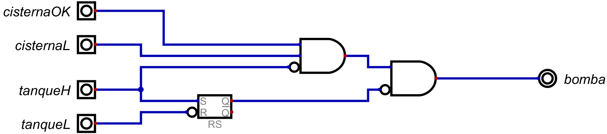

# Informe de Desarrollo de un Controlador Digital de Bomba de Agua

Electrónica IV - TP - Automatismos y Máquinas Elementales

## Introducción

Este controlador de bomba de agua permite cargar el agua de su tanque de forma automatica. Posee protección para evitar que la bomba succione aire, además evita su encendido y apagado constante para alargar la vida útil de esta.  

## Metodología de trabajo

Se decidió hacer una lógica asincrónica, con lógica positiva es decir que la bomba se activa con "1". Teniendo en cuenta los sensores que se posee:

|Sensor         | Condición                                                                      |
|---------------|--------------------------------------------------------------------------------|
| *cisternaL*   | Debajo de este nivel la bomba no puede estar encendida porque puede descebarse |
| *cisternaOK*  | Nivel suficiente para encender la bomba de agua                                |
| *tanqueL*     | Debajo de este nivel de agua es necesario llenar el tanque                     |
| *tanqueH*     | Es el máximo nivel que puede alcanzar el tanque sin rebalsar                   |

  
Para la realización se pensó en los casos en los que la bomba debería estar encendida y apagada si o sí:
1. La bomba esta **encendida** si *cisternaOK = 1 \^ cisternaL = 1 \^ tanqueL = 1*
2. La bomba esta **apagada** si *cisternaL = 0 \^ tanqueH = 1*

Luego se tuvo que pensar en la lógica que que evite que cada vez que el tanque se descargue por debajo de *tanqueH* la bomba se active, para evitar disminuir su vida útil. Para ello se vio que es necesario un elemento de memoria que guarde el valor que poseía este sensor hasta que *tanqueL=0*. 
Se decidió usar un *latch SR*  de tal forma que:
- *tanqueH* lo ponga en estado alto cuando es "1"
- *tanqueL* lo ponga en estado bajo cada vez este sea "0"

De esta forma se dividió la lógica en tres:
1. Una parte que se encarga de forzar el encendido/apagado de la bomba a partir de los sensores *tanqueH, cisternaOk y cisternaL*. Lo cual se realizó con una compuerta "AND" siguiendo lo explicado al inicio, de tal forma que un "1" en  *cisternaL* o *tanqueH* apague la bomba.
2.  Y la otra que memorice si *tanqueH* estaba en "1" y que cuando  *tanqueL* sea "0" haga un reset al latch. 
3.  A partir de la salida de las etapas anteriores active o desactive la bomba siguiendo la siguiente tabla de verdad:

| A  | B  | Bomba |
|----|----|-------|
| 0  | 0  | 0     |
| 0  | 1  | 0     |
| 1  | 0  | 1     |
| 1  | 1  | 0     |

Donde *A* es la salida de la primera etapa, *B* la salida de la segunda, y *Bomba* la señal que controla la bomba.
  
  

## Resultados
El resultado obtenido realiza lo que se propuso.

  

## Conclusiones

El controlador es un automatismo, pues no posee un procesador y no tiene un programa que seguir.
