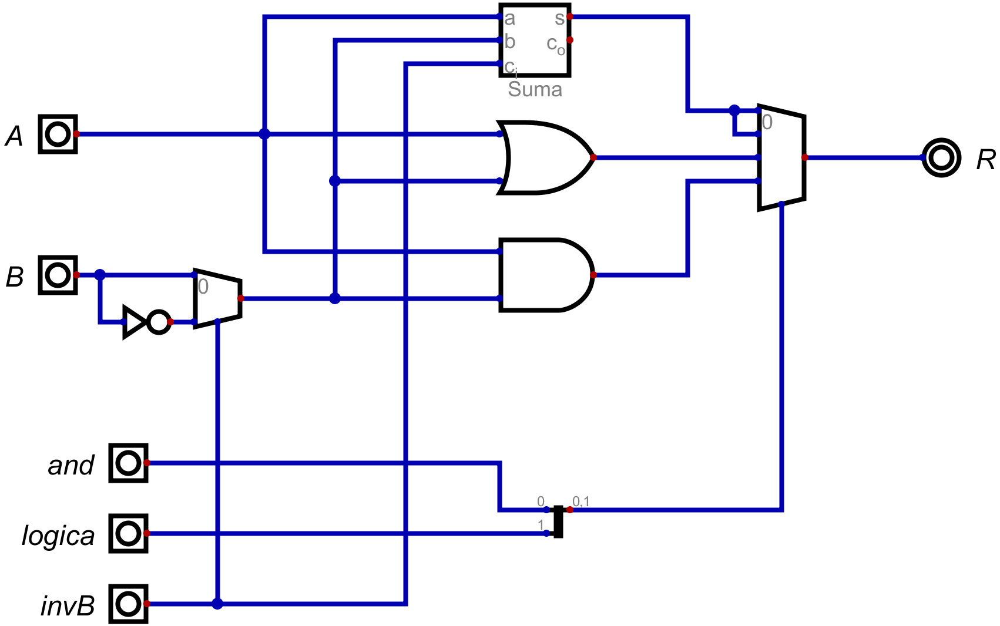

# Informe de Desarrollo de una Unidad Aritmética Lógica (ALU) de 16 bit

Electrónica IV - TP - Automatismos y Máquinas Elementales

## Introducción

*ALU* es unidad aritmetica logica, es un circuito digital que realiza operaciones aritmeticas y logicas.

## Metodología de trabajo

Como se desea tener un selector que elija la operacion a realizar lo que se hizo fue usar un multiplexor. A Las entradas de este se conectaron las distintas operaciones que se deben realizar segun el orden del selector:

| invB | Log | And | Operación |
| ---- | --- | --- | --------- |
| 0    | 0   | 0   | A + B     |
| 0    | 0   | 1   | A + B     |
| 0    | 1   | 0   | A v B     |
| 0    | 1   | 1   | A ^ B     |
| 1    | 0   | 0   | A - B     |
| 1    | 0   | 1   | A - B     |
| 1    | 1   | 0   | A v !B    |
| 1    | 1   | 1   | A ^ !B    |

Como se poseen 3 bits de selección y el multiplexor del programa digital necesita que estos esten en un bus se utiliza un "Divisor/Agrupador" para unir los bits en un vus de datos, donde el bit superior es *LSB* y el inferior el *MSB*.

Luego para realizar las operaciones se aprovechó los componentes que provee *Digital*, excepto por el restador. Hay dos operaciones que se deben explicar un poco:
#### Suma
En este caso, como el programa posee un sumador completo es necesario introducir un cero en *carry*. Para que la operación se realice correctamente.
#### Resta
Se utilizo un sumador aprovechando el complemento a dos, como se explica a continuacion:
(A-B)_C2 = (A)_C2 + (-B)_C2 = (A)_C2 + (B)_C2 + 1
Como el complemento a 2 de un número positivo es el mismo número y el de un número negativo es a su complemento a uno sumarle 1. Como el complemento a 1 se obtiene invirtiendo el número entonces se niega B.
Entonces lo que se hace es al sumador introducir A,!B y carry = 1 de esta forma se realiza la operación anterior.

## Resultados
El resultado fue el siguiente:

## Conclusiones

La *ALU* desarrollada es un automatismo, pues no posee un procesador ni un programa.
